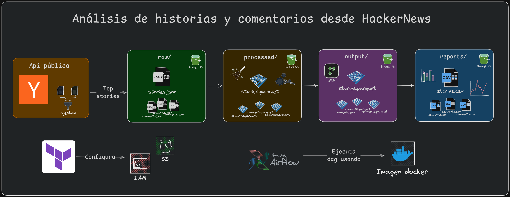

# HN Analytical Platform

Data lake batch completo basado en datos públicos de **Hacker News**. Pipeline idempotente: ingesta de API → enriquecimiento temporal + NLP → reportes analíticos en CSV.



**Stack:** Python 3.13 · Pandas · PyArrow · Airflow · DuckDB · S3 · Terraform

---

## Visión General

Plataforma de **datos batch** que:
- **Ingiere** datos crudos de la API pública de Hacker News (stories y comentarios recursivos)
- **Procesa** limpieza, tipado, deduplicación y validación de integridad
- **Transforma** enriquecimiento con métricas temporales, TF-IDF topics y análisis de sentimiento VADER
- **Reporta** KPIs de negocio en formato CSV consumible

**Periodicidad:** Daily (configurable)  
**SLA:** Runs complete in ~5-15 minutos (sin fallos de red)  
**Volumen típico:** 500-2000 stories + 10-50k comentarios por día  
**Almacenamiento:** S3 (MinIO local) con particionamiento por fecha de ingesta

---

## Arquitectura

### Modelo Medallion Pragmático

```
RAW (bronze/)           → Ingesta inmutable desde API HN
   └─ stories/ingestion_date=YYYY-MM-DD/
   └─ comments/ingestion_date=YYYY-MM-DD/

PROCESSED (silver/)     → Limpieza, tipado, deduplicación
   └─ stories/ingestion_date=YYYY-MM-DD/
   └─ comments/ingestion_date=YYYY-MM-DD/

OUTPUT (gold/)          → Enriquecido, listo para consumo
   └─ stories/ingestion_date=YYYY-MM-DD/    [temporal metrics + topics + sentiment]
   └─ comments/ingestion_date=YYYY-MM-DD/   [sentiment labels]

REPORTS                 → KPIs de negocio en CSV
   └─ top_stories_by_score_velocity/ingestion_date=YYYY-MM-DD/
   └─ engagement_speed/ingestion_date=YYYY-MM-DD/
   └─ sentiment_by_story/ingestion_date=YYYY-MM-DD/
   └─ topic_trends/ingestion_date=YYYY-MM-DD/
   └─ long_tail_stories/ingestion_date=YYYY-MM-DD/

METADATA                → Tracking y auditoría
   └─ story_tracking.json

LOGS                    → Ejecución y errores
   └─ logs/{pipeline}/execution_date=YYYY-MM-DD/
```

### Características de Confiabilidad

- **Idempotencia:** Cada partición (by `ingestion_date`, exceptuando datos raw) sobrescribe. Rerunnable N veces = mismo output.
- **Recuperable:** Cada stage checkpointea (carga anterior, lo que falta). Fallo = reintentos automáticos.
- **Trazable:** Data lineage desde API → CSV. Logs y quality reports.
- **Validado:** 45+ quality checks (not_null, unique, referential_integrity, volume, type, range).

---

## Stack Técnico

| Capa | Tecnología | Justificación |
|------|-----------|------------|
| **Lenguaje** | Python 3.13 | Type hints, performance, data ecosystem |
| **Ingesta** | Requests + Generators | Fetch recursivo sin buffering; memory O(1) |
| **Procesamiento** | Pandas + PyArrow | Serialización Parquet; compresión snappy |
| **Almacenamiento** | S3 (MinIO) | Particionado, versionable, costo-efectivo |
| **Orquestación** | Apache Airflow | DAG batch, retries, monitoring |
| **Queries analíticas** | DuckDB | SQL sobre Parquet en S3; sin ETL intermediario |
| **Análisis de texto** | TF-IDF + VADER | Topics + Sentiment sin ML pesado |
| **IaC** | Terraform | Prefijos S3 versionados y reproducibles |
| **Testing** | Pytest | 222+ tests; mocks de S3 y API |
| **Logs** | RotatingFileHandler | Local + S3 (audit trail) |

**Total LOC (src/):** ~3482  
**Test LOC:** ~2500+  
**Builders:** uv (fast Python packaging), Docker multi-stage

---

## Configuración Rápida

### Prerequisites

- **Docker & Docker Compose** (services: Airflow, MinIO, Postgres)
- **Python 3.13+** (local dev)
- **uv** (package manager, opcional pero recomendado)
- **Terraform 1.6+** (IaC)

### 1. Clonar & Preparar

```bash
git clone <repo>
cd hn-analytical-platform
```

### 2. Variables de Entorno

```bash
# infrastructure/docker/.env

# Postgres
POSTGRES_USER=your_user
POSTGRES_PASSWORD=your_pass
POSTGRES_DB=your_db

# Airflow
AIRFLOW_FERNET_KEY=your_key
AIRFLOW_ADMIN_USERNAME=your_user
AIRFLOW_ADMIN_PASSWORD=your_pass
AIRFLOW_SECRET_KEY=your-secret-key-change-in-production
AIRFLOW_UID=your_uid
AIRFLOW_GID=your_gid

# MinIO
MINIO_BUCKET_NAME=your_name
MINIO_ENDPOINT_URL=your_endpoint
MINIO_ROOT_USER=your_user
MINIO_ROOT_PASSWORD=your_pass
MINIO_ACCESS_KEY=${MINIO_ROOT_USER}
MINIO_SECRET_KEY=${MINIO_ROOT_PASSWORD}
```

### 3. Levantar Servicios

```bash
# Opción A: Makefile (recomendado)
make up          # Docker Compose up -d
make ps          # Ver servicios activos
make logs        # Tail logs

# Opción B: Docker directo
docker-compose -f infrastructure/docker/docker-compose.yml up -d
```

**Servicios listos en ~2 min:**
- **Airflow WebUI:** http://localhost:8080 (airflow/airflow)
- **MinIO Console:** http://localhost:9001 (your_user/your_pass)

### 4. Terraform (Buckets & Prefijos)

Acá recordar la creación del archivo terraform.tfvars para
definir credenciales.

```bash
# Conectarse a la red de Docker
docker network create docker_airflow-network 2>/dev/null || true

# Plan & Apply
make tf-init
make tf-plan
make tf-apply

# Verificar en MinIO Console → hn-analytical-platform bucket
```

---

## Ejecución

### A. Opción 1: Airflow DAG (Recomendado)

**DAG:** `hn_etl` (definido en `infrastructure/orchestration/dags/dag.py`)

```bash
# Listar DAGs
make airflow-dags

# Activar DAG en WebUI
# http://localhost:8080
# → DAG: hn_etl → Toggle ON → Trigger

# O por CLI
make airflow-trigger DAG=hn_etl

# Monitorear logs
make airflow-scheduler-logs
```

### B. Opción 2: Ejecución Local (Dev)

```bash
# Shell en contenedor dev
make dev-shell

# O comando directo
make dev-run CMD="python -m ingestion.main"
make dev-run CMD="python -m processing.main 2026-02-21"
make dev-run CMD="python -m transformation.main 2026-02-21"
make dev-run CMD="python -m analytics.main 2026-02-21"
```

### C. Opción 3: Tests

```bash
# Todos los tests (222+)
make test

# Test específico
make dev-run CMD="pytest tests/processing/test_hn_processor.py -v"

# Con coverage
make dev-run CMD="pytest --cov=src tests/"
```

---

## Esquema de Datos

### Stories (Output)

```python
{
    "id": int,
    "title": str,
    "type": str,          # "story", "job", "poll"
    "url": str | None,
    "text": str | None,
    "score": int,
    "descendants": int,   # comment count
    "by": str,            # author
    "time": int,          # unix timestamp
    
    # Temporal metrics (enriquecido)
    "score_velocity": float,        # score/hour
    "comment_velocity": float,      # comments/hour
    "hours_to_peak": float,         # when max score reached
    "is_long_tail": bool,           # active >48h
    "observations_in_window": int,  # rechecks in 7-day window
    
    # NLP (enriquecido)
    "dominant_topics": str,         # "python,ai,web" (TF-IDF)
    
    # Metadata
    "ingestion_date": str,          # partition key YYYY-MM-DD
    "ingest_timestamp": str,        # when fetched
}
```

### Comments (Output)

```python
{
    "id": int,
    "parent": int,                  # story ID
    "by": str,
    "text": str,
    "time": int,
    "score": int,
    
    # Sentiment (enriquecido)
    "sentiment_score": float,       # -1.0 to 1.0 (VADER)
    "sentiment_label": str,         # "positive", "negative", "neutral"
    
    # Metadata
    "ingestion_date": str,
    "ingest_timestamp": str,
}
```

---

## Reportes Analíticos

Todas las queries se ejecutan en **analytics/main.py** → guardan CSV en `reports/`:

### 1. `top_stories_by_score_velocity`
- **Query:** Top 20 stories ordenadas por velocidad de crecimiento de score
- **Columnas:** `id, title, score, score_velocity, comment_velocity, hours_to_peak, is_long_tail, dominant_topics`
- **Uso:** Identificar trending stories en tiempo real

### 2. `engagement_speed`
- **Query:** Categorización de engagement (fast ≤6h, medium 6-24h, slow >24h)
- **Columnas:** `speed_category, story_count, avg_score, avg_comments`
- **Uso:** Análisis de dinámica de participación

### 3. `sentiment_by_story`
- **Query:** Distribución de sentimiento por story (positive/negative/neutral)
- **Columnas:** `id, title, total_comments, avg_sentiment, positive, negative, neutral`
- **Uso:** Monitoreo de controversia/polarización

### 4. `topic_trends`
- **Query:** Frecuencia y score promedio de topics dominantes (top 30)
- **Columnas:** `topic, frequency, avg_score`
- **Uso:** Tendencias de contenido

### 5. `long_tail_stories`
- **Query:** Stories con actividad sostenida >48h
- **Columnas:** `id, title, score, descendants, hours_to_peak, comment_velocity, observations_in_window`
- **Uso:** Identificar stories con engagement duradero

---

## Alcance y Limitaciones

### In Scope ✓

- **Ingesta diaria** de top 30 stories + comentarios recursivos desde API HN
- **Validación de calidad** en cada capa (45+ checks)
- **Enriquecimiento NLP** (TF-IDF, VADER) sin modelos pesados
- **Reportes SQL** via DuckDB sin infra adicional
- **Idempotencia garantizada** (rerunnable para procesamiento, transformaciones y reportes)
- **Batch processing** simplificado (sin streaming, sin complexity innecesaria)
- **IaC completa** (Terraform para S3, Airflow DAG, Docker)
- **Testing extensivo** (222+ tests)

### Out of Scope ✗

- **Real-time streaming** (Kafka, Spark Structured Streaming) — No hay SLA <5min
- **Data warehouse** (Snowflake, Redshift) — Overkill para este volumen
- **BI integrado** (Tableau, Looker dashboards) — CSV es consumible vía Excel/Python
- **Fine-grained access control** — MinIO es local; producción requiere IAM
- **Schema evolution** automática — Cambios manuales esperados
- **Backfill histórico** — Pipeline es forward-only (no viaja atrás en tiempo)

---

## Virtudes del Diseño

1. **Pragmático:** Batch simple > streaming complejo. Python estándar > Scala.
2. **Fiable:** Idempotente, recoverable, observable. Operabilidad 3AM-friendly.
3. **Escalable (hasta 10x):** Particionamiento por fecha, no full table scans.
4. **Testeable:** 222+ tests; mocks de S3 y API; fixtures reutilizables.
5. **Documentado:** Docstrings, type hints, logs estructurados, README completo.
6. **Costo-efectivo:** MinIO local, batch diario, Parquet comprimido (snappy).

---

## Deficiencias Conocidas

1. **Sin CI/CD:** No hay GitHub Actions; tests manuales.
2. **Sin alerting:** Airflow notifica errores pero sin Slack/PagerDuty.
3. **Sin versionado de datos:** Overwrite por partición; sin CDC trail.
4. **Queries hardcodeadas:** 5 reportes fijos; extensible pero no dinámico.
5. **Monitoreo básico:** Logs rotativos; sin métricas de performance (P50, P95).

---

## Próximos Pasos (Si Fuera Producción)

1. **CI/CD:** GitHub Actions → run tests, build Docker, push registry
2. **Alerting:** Airflow + Slack para fallos SLA
3. **Monitoring:** Prometheus + Grafana para latencia y volumen
4. **Data warehouse:** Snapshot a PostgreSQL/Snowflake (append-only)
5. **API REST:** FastAPI + Pydantic para consumo de reportes
6. **Versionado:** DVC o Delta Lake para auditoría de cambios

---

## Contribución & Licencia

**Autor:** Gerardo Toboso  
**Contacto:** gerardotoboso1909@gmail.com  
**Licencia:** MIT License
